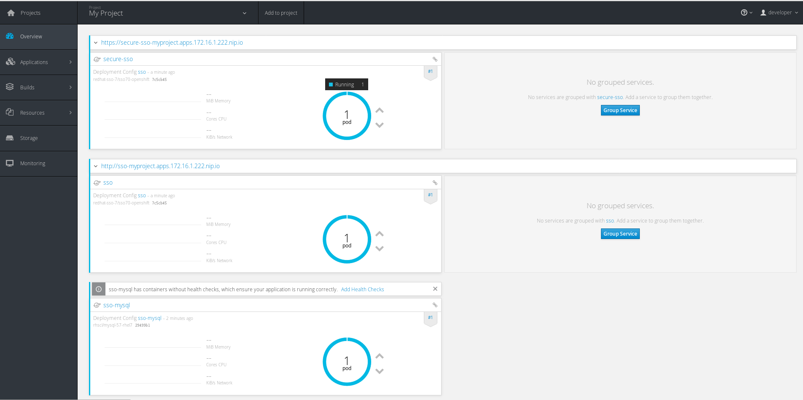

# Deploy SSO On OpenShift

The quickest way to get OpenShift up and running is download the `oc` binary [here](https://github.com/openshift/origin/releases). Then run:

```
oc cluster up --image=registry.access.redhat.com/openshift3/ose --version=v3.5
```

This assumes that you have a Mac/Windows/Linux machine with `docker` running.

Note that if using something other than 'oc cluster up' create a new project named myproject if it does not already exist.

```
oc new-project myproject
```

Before you start; clone this repo

```
git clone https://github.com/RedHatWorkshops/red-hat-sso
```

Then cd into the directory with the lab01 ocp materials

```
cd lab01-setup-sso/ocp
```

## SSL Keystore

This repository includes an already made SSL Keystore file as `keystore.jks`. You can use this or create your own with the following command.

```
keytool -genkeypair -alias keystore -storetype jks -keyalg RSA -keysize 2048 -keypass password1 -keystore keystore.jks -storepass password1 -dname "CN=SSL-Keystore,OU=Sales,O=Systems Inc,L=Raleigh,ST=NC,C=US" -validity 730 -v
```

## JGroups Keystore

Like the SSL Keystore; this repo includes a JGroup Keystore as `jgroups.jceks`. You can use this or create one using the following.

```
keytool -genkeypair -alias jgroups -storetype jceks -keyalg RSA -keysize 2048 -keypass password1 -keystore jgroups.jceks -storepass password1 -dname "CN=JGROUPS,OU=Sales,O=Systems Inc,L=Raleigh,ST=NC,C=US" -validity 730 -v
```

## Create secrets and service accounts

Create a secret based on the Keystore files provided in this repo (or use the ones you created); to upload them into OpenShift

```
oc create secret generic sso-app-secret --from-file=keystore.jks --from-file=jgroups.jceks
```

Now create an OpenShift service account

```
oc create serviceaccount sso-service-account
```

Lastly; give the proper permissions to the service account you just created and give it access to the secret. Take special care that you're using the right proper project name. Here I'm using `myproject`; which is the project created in an `oc cluster up` installation of OpenShift.

```
oc policy add-role-to-user view system:serviceaccount:myproject:sso-service-account -n myproject
oc secret add sa/sso-service-account secret/sso-app-secret
```

## Import Image Streams

In order to import image streams (included in this repo) you need to login as admin. Make sure you use the right project. Again, below I'm using the project `myproject`

```
oc login -u system:admin
oc create -n openshift -f jboss-image-streams.json
oc process -f sso70-mysql.json --param HTTPS_NAME=keystore --param HTTPS_PASSWORD=password1 | oc create -n myproject -f -
```

## Success

Login to your OpenShift instance; you should see the following if successful.

