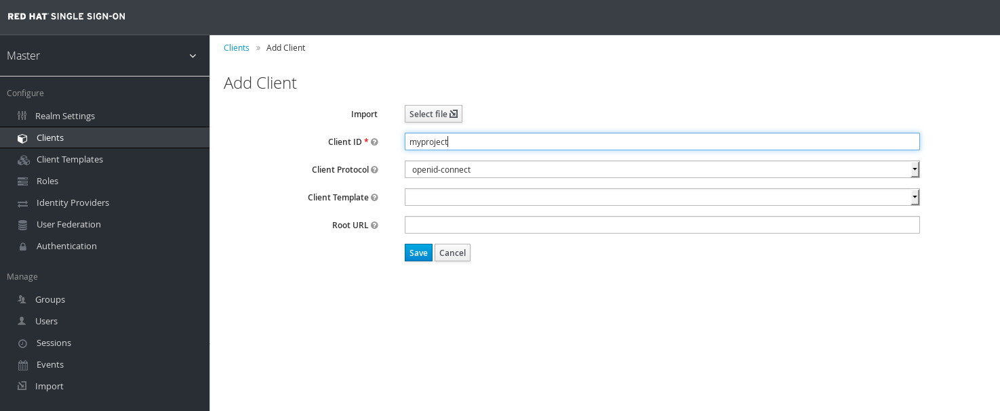

# Integrate LDAP

You can Federate backend authentication systems into SSO to manage users centrally. In this lab we will spin up a [FreeIPA](http://www.freeipa.org/page/Main_Page) server that provides LDAP functionality.

NOTE: This works with `oc cluster up` or environments with dymanic storage.

## Install SSO

If you haven't done so already, please do [Lab 01](https://github.com/RedHatWorkshops/red-hat-sso/blob/master/labs/lab01-setup-sso/ocp/README.md) of the OpenShift track to get an SSO system up and running.

## Install FreeIPA  Template

Import the community version of FreeIPA template into OpenShift to test on if you don't have an LDAP server handy.

```
oc login -u system:admin
oc create -f https://raw.githubusercontent.com/freeipa/freeipa-container/master/freeipa-server-openshift.json -n openshift
```

Next, import the image as the developer user

```
oc login -u developer
oc import-image freeipa-server:latest --from=adelton/freeipa-server:centos-7 --confirm
```

## Deploy FreeIPA

Now that you have the template and image imported; install FreeIPA on OpenShift.

Create Service Account

```
oc project myproject
oc create serviceaccount useroot 
oc adm policy add-scc-to-user anyuid -z useroot
```

Next, login to your webconsole and create your ipa server with the following parameters, in the `myproject` project. The defaults should be fine.


Once you are sure of the parameters; click "Create"

FreeIPA generates certificates/keys for itself so you might need to generate some activity on your system, if you look at the deployment logs and see the following

```
Configuring Kerberos KDC (krb5kdc). Estimated time: 30 seconds
  [1/9]: adding kerberos container to the directory
  [2/9]: configuring KDC
  [3/9]: initialize kerberos container
WARNING: Your system is running out of entropy, you may experience long delays
```

Just run this to speed it along (run ^c after a minute or two)
```
while true; do find /; done 
```

Add the router's IP address in your `/etc/hosts` file (HINT: it's the IP address of where you ran `oc cluster up`) in order to access the fake domain you created

```
172.16.1.222	ipa.example.test
```

Login to the pod to find out the admin password

```
[root@ocp-aio]# oc get pods 
NAME                     READY     STATUS    RESTARTS   AGE
freeipa-server-1-dp1sv   1/1       Running   0          15m
sso-1-sp5ws              1/1       Running   0          1h
sso-mysql-1-3tbj7        1/1       Running   0          1h

[root@ocp-aio]# oc exec freeipa-server-1-dp1sv -- env | grep PASSWORD
PASSWORD=5YqaAHLmgXHjWvUlXarmFN7yunhXOIRS
```

Login with `username: admin` and `password: <the displayed password>`

```
firefox https://ipa.example.test
```
## Add LDAP User(s)

Fastest way is with `oc rsh`; so find out your pod name.

```
[root@ocp-aio ]# oc get pods
NAME                     READY     STATUS    RESTARTS   AGE
freeipa-server-1-dp1sv   1/1       Running   0          2h
sso-1-sp5ws              1/1       Running   0          3h
sso-mysql-1-3tbj7        1/1       Running   0          3h
```

Now `oc rsh` into this pod

```
[root@ocp-aio ]# oc rsh freeipa-server-1-dp1sv
sh-4.2#
```

Obtain a Kerberos ticket

```
sh-4.2# echo $PASSWORD | kinit admin@$(echo ${IPA_SERVER_HOSTNAME#*.} | tr '[:lower:]' '[:upper:]')
```

You should be able to show your IPA config now

```
sh-4.2# ipa config-show
  Maximum username length: 32
  Home directory base: /home
  Default shell: /bin/sh
  Default users group: ipausers
  Default e-mail domain: example.test
  Search time limit: 2
  Search size limit: 100
  User search fields: uid,givenname,sn,telephonenumber,ou,title
  Group search fields: cn,description
  Enable migration mode: FALSE
  Certificate Subject base: O=EXAMPLE.TEST
  Password Expiration Notification (days): 4
  Password plugin features: AllowNThash
  SELinux user map order: guest_u:s0$xguest_u:s0$user_u:s0$staff_u:s0-s0:c0.c1023$unconfined_u:s0-s0:c0.c1023
  Default SELinux user: unconfined_u:s0-s0:c0.c1023
  Default PAC types: nfs:NONE, MS-PAC
  IPA masters: ipa.example.test
  IPA CA servers: ipa.example.test
  IPA NTP servers: 
  IPA CA renewal master: ipa.example.test
```


Add a user now

```
sh-4.2# ipa user-add homer --first=Homer --last=Simpson --gecos="Homer J. Simposon"  --email=homerj@mailinator.com --homedir=/home/homer --password
Password: 
Enter Password again to verify: 
------------------
Added user "homer"
------------------
  User login: homer
  First name: Homer
  Last name: Simpson
  Full name: Homer Simpson
  Display name: Homer Simpson
  Initials: HS
  Home directory: /home/homer
  GECOS: Homer J. Simposon
  Login shell: /bin/sh
  Principal name: homer@EXAMPLE.TEST
  Principal alias: homer@EXAMPLE.TEST
  Email address: homerj@mailinator.com
  UID: 50800003
  GID: 50800003
  Password: True
  Member of groups: ipausers
  Kerberos keys available: True
```

You should be able to list the user's attributes

```
sh-4.2# ipa user-find homer
--------------
1 user matched
--------------
  User login: homer
  First name: Homer
  Last name: Simpson
  Home directory: /home/homer
  Login shell: /bin/sh
  Principal name: homer@EXAMPLE.TEST
  Principal alias: homer@EXAMPLE.TEST
  Email address: homerj@mailinator.com
  UID: 50800003
  GID: 50800003
  Account disabled: False
----------------------------
Number of entries returned 1
----------------------------

```

## Import LDAP users into SSO

Navigate and login into your `<ssourl>/auth/admin`; for example mine was `https://secure-sso-myproject.apps.172.16.1.222.nip.io/auth/admin`. The login page should look like this


The default login is:

```
username: admin
password: admin
```

Navigate to `User Federation ~> Add Provider` and select `ldap`

Configure with the following Parameters

* `Edit Mode: WRITABLE`
* `Vendor: Red Hat Directory Server`
* `Username LDAP attribute: uid`
* `RDN LDAP attribute: uid`
* `UUID LDAP attribute: uid`
* `User Object Classes: person`
* `Connection URL: ldap://freeipa-server` - Change this to your servicename or service IP Address
* `Users DN: cn=users,cn=accounts,dc=example,dc=test` - If you want a specific OU, specify that OU (this gets ALL users)
* `Authentication Type: none` - Uses anonymous bind
* `Search Scope: One Level`

Consult the below picture if you get stuck


Now you can create a user and click on `Synchronize changed users` and you'll be able to see users on the `Users` section (left hand navigation side)


You should be able to see the user `homer` in the `Users` section

## Test Connection

First, you need to create a new client on your SSO installation. On the left navigation click "Clients" then click "Create"



In the "Client ID" name it `myproject` and leave the "Client Protocol" as `openid-connect`. Click save.

Now, use `curl` against your `<sso url>/auth/realms/master/protocol/openid-connect/token`. Keep in mind that the `client_id` should be the name of the client you created just now. In this example it's `myproject`. For `username` and `password`; use the creds you created in the LDAP server. In this example; we created the `homer` user.

```
curl -s  \
--data "grant_type=password&client_id=myproject&username=homer&password=homer" \
-k https://secure-sso-myproject.apps.172.16.1.222.nip.io/auth/realms/master/protocol/openid-connect/token | python -m json.tool
{
    "access_token": "eyJhbGciOiJSUzI1NiJ9.eyJqdGkiOiIzMmVjYzNiOS0zOWZiLTRiZTMtYWE0OC1mZWZhMWIwMDU3YmEiLCJleHAiOjE0OTU3MzQ3MzQsIm5iZiI6MCwiaWF0IjoxNDk1NzM0Njc0LCJpc3MiOiJodHRwczovL3NlY3VyZS1zc28tbXlwcm9qZWN0LmFwcHMuMTcyLjE2LjEuMjIyLm5pcC5pby9hdXRoL3JlYWxtcy9tYXN0ZXIiLCJhdWQiOiJteXByb2plY3QiLCJzdWIiOiJmOGM4YjkyYS0zZWVjLTQ5ZDMtYmU3MC1jNDA0MTNkNTY2MDIiLCJ0eXAiOiJCZWFyZXIiLCJhenAiOiJteXByb2plY3QiLCJzZXNzaW9uX3N0YXRlIjoiYTFiNzkxYTEtYzFhNC00YTAxLThkMDctNDMzODI5NjFiNjYxIiwiY2xpZW50X3Nlc3Npb24iOiI5MmMyNzI5Yy0yNzA5LTRlNmYtOThlZS0yZTQ4YmEwMTdjYzIiLCJhbGxvd2VkLW9yaWdpbnMiOltdLCJyZXNvdXJjZV9hY2Nlc3MiOnsiYWNjb3VudCI6eyJyb2xlcyI6WyJtYW5hZ2UtYWNjb3VudCIsInZpZXctcHJvZmlsZSJdfX0sIm5hbWUiOiJIb21lciBTaW1wc29uIFNpbXBzb24iLCJwcmVmZXJyZWRfdXNlcm5hbWUiOiJob21lciIsImdpdmVuX25hbWUiOiJIb21lciBTaW1wc29uIiwiZmFtaWx5X25hbWUiOiJTaW1wc29uIn0.Ch2MJdVp8_2OdP1GOF6NKvQUYUzXa6HZzBel9x8g-SebmjlMNkp-4ryYHrHSeGkNNqtds9e_whf4ISS4Zs1kfskGm5qqiM1EojpLEdt2KBRAvy6c16unf8qBLiJtMqvQZjJYTio4OJoDuCOHDn1-DyE3GbYaGqXrBioPAkjObYRtJrZM-LqDRAUsRWklh9KJ56wrgcqgbUKiScQh1w3gJNZ093vySiFRUBzWJAgmYaZqGEFt1LVcWvGCXMVfCUUKYV2X_kky2v-Ubl3x6c8UOD4wgGL8tluzJ21pnzMfqeONT9uEdI9NHpJ0shuAVXM_e5Q51PAAlxxSH3FDqwnYWw",
    "expires_in": 60,
    "id_token": "eyJhbGciOiJSUzI1NiJ9.eyJqdGkiOiJiNmM3OGI5Zi01OWM0LTQ1MjktYmE1OS1mNzU3ZjQxOTYzMTgiLCJleHAiOjE0OTU3MzQ3MzQsIm5iZiI6MCwiaWF0IjoxNDk1NzM0Njc0LCJpc3MiOiJodHRwczovL3NlY3VyZS1zc28tbXlwcm9qZWN0LmFwcHMuMTcyLjE2LjEuMjIyLm5pcC5pby9hdXRoL3JlYWxtcy9tYXN0ZXIiLCJhdWQiOiJteXByb2plY3QiLCJzdWIiOiJmOGM4YjkyYS0zZWVjLTQ5ZDMtYmU3MC1jNDA0MTNkNTY2MDIiLCJ0eXAiOiJJRCIsImF6cCI6Im15cHJvamVjdCIsInNlc3Npb25fc3RhdGUiOiJhMWI3OTFhMS1jMWE0LTRhMDEtOGQwNy00MzM4Mjk2MWI2NjEiLCJuYW1lIjoiSG9tZXIgU2ltcHNvbiBTaW1wc29uIiwicHJlZmVycmVkX3VzZXJuYW1lIjoiaG9tZXIiLCJnaXZlbl9uYW1lIjoiSG9tZXIgU2ltcHNvbiIsImZhbWlseV9uYW1lIjoiU2ltcHNvbiJ9.MQP2lBgg1dGdLJDN5djYHXNYhQV2duZzzbGcFgcdYpm9zMbWRWKPFkRMdrP9ZDlREnVpyIZchmxtvsitXNbKVv_p8ExhBfwGrc9KJF_mFq494784aj2W_h-qwiqMxMwCZMFAMkAY5vr7CFJU-VEbCMCN8MaXic9N-zDyj454dZLPGFk1rdvdtz81W4qEahlteCTdaVF-yxnJ0Dpwp2a-XUyNkZCNMdBTxB0f1Y8uLveqip-sW7VwFxa0hgXlTJi9YFeqD2bWbue7vchPZr4n-HBlbbVrBXJfa8KDcIGLridAO1K7iAwqyKnqjorHuI1dn0kGXdAV_lTJWhhyTzBT2w",
    "not-before-policy": 0,
    "refresh_expires_in": 1800,
    "refresh_token": "eyJhbGciOiJSUzI1NiJ9.eyJqdGkiOiI5NzE0OTBhZC0wOTU1LTQ1MzYtODY3ZS04M2FjMzIwNjhkZmEiLCJleHAiOjE0OTU3MzY0NzQsIm5iZiI6MCwiaWF0IjoxNDk1NzM0Njc0LCJpc3MiOiJodHRwczovL3NlY3VyZS1zc28tbXlwcm9qZWN0LmFwcHMuMTcyLjE2LjEuMjIyLm5pcC5pby9hdXRoL3JlYWxtcy9tYXN0ZXIiLCJhdWQiOiJteXByb2plY3QiLCJzdWIiOiJmOGM4YjkyYS0zZWVjLTQ5ZDMtYmU3MC1jNDA0MTNkNTY2MDIiLCJ0eXAiOiJSZWZyZXNoIiwiYXpwIjoibXlwcm9qZWN0Iiwic2Vzc2lvbl9zdGF0ZSI6ImExYjc5MWExLWMxYTQtNGEwMS04ZDA3LTQzMzgyOTYxYjY2MSIsImNsaWVudF9zZXNzaW9uIjoiOTJjMjcyOWMtMjcwOS00ZTZmLTk4ZWUtMmU0OGJhMDE3Y2MyIiwicmVzb3VyY2VfYWNjZXNzIjp7ImFjY291bnQiOnsicm9sZXMiOlsibWFuYWdlLWFjY291bnQiLCJ2aWV3LXByb2ZpbGUiXX19fQ.NNlYkgiBYF0F7D_WvWMmyGctBH-D_yXZz5HtF8Eg5efUzxfuP1UqdZurpRKKr69f9P6VRJxaQEctMrPw_gHUvlA0_OiWtksGSoKy1NiG9xipQ6ZVWwKa6sXXOcaPC8Kbg45U2GGh1Cajd65BDzzhiA-HnH8ko-KR5AP7hqQy2DPKemqO8oDMhxQy3ICAXWDLQuG9WG0_CWKK2ExFB79P8oyQKtnqiQNwHj2Ai9U5du_ckWEKU458KmcYrlJ6iaOlPdmOH4lOa-WMD2s0cXq5qM7al_gr2Yd-A73zS6gGbyvnh78gFFQldbuA6d1tr0B0BJg-RqR-VbFkeOQMZe7YVQ",
    "session_state": "a1b791a1-c1a4-4a01-8d07-43382961b661",
    "token_type": "bearer"
}
```

Provide a bad password to see what an error looks like
```
curl -s \
--data "grant_type=password&client_id=myproject&username=homer&password=badpassword" \
-k https://secure-sso-myproject.apps.172.16.1.222.nip.io/auth/realms/master/protocol/openid-connect/token | python -m json.tool
{
    "error": "invalid_grant",
    "error_description": "Invalid user credentials"
}
```
