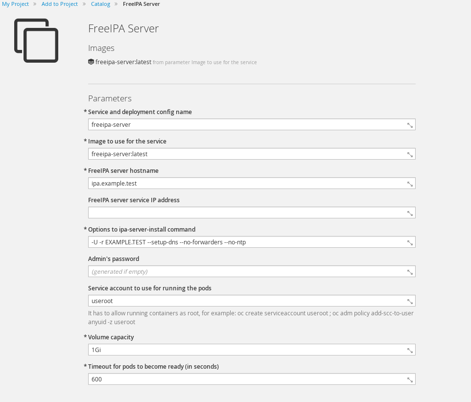

# Integrate LDAP

You can Federate backend authentication systems into SSO to manage users centrally

## Install SSO

Follow the guide [here](https://github.com/RedHatWorkshops/red-hat-sso/blob/master/labs/lab01-setup-sso/ocp/README.md)

## Install FreeIPA  Template

Import the community version of FreeIPA template into openshift

```
oc create -f https://raw.githubusercontent.com/freeipa/freeipa-container/master/freeipa-server-openshift.json -n openshift
```


## Deploy FreeIPA

NOTE: This works with `oc cluster up` or environments with dymanic storage.

Create Service Account

```
oc project hackathon
oc create serviceaccount useroot 
oc adm policy add-scc-to-user anyuid -z useroot
```

Next, create your ipa server with the following parameters



In order for the deploymnet to kick off...edit the deployment config; and change the image to `adelton/freeipa-server:centos-7`


OPTIONAL: If you look at the deployment logs and see the following

```
Configuring Kerberos KDC (krb5kdc). Estimated time: 30 seconds
  [1/9]: adding kerberos container to the directory
  [2/9]: configuring KDC
  [3/9]: initialize kerberos container
WARNING: Your system is running out of entropy, you may experience long delays
```

It means that your system isn't creating enough random data; run this to speed it along (run ^c after a minute or two)
```
while true; do find /; done 
```

Add the router's IP address in your `/etc/hosts` file in order to access the fake domain you created

```
172.16.1.222	ipa.example.test
```

Login to the pod to find out the admin password

```
[root@ocp-aio]# oc get pods 
NAME                     READY     STATUS    RESTARTS   AGE
freeipa-server-1-dp1sv   1/1       Running   0          15m
sso-1-sp5ws              1/1       Running   0          1h
sso-mysql-1-3tbj7        1/1       Running   0          1h

[root@ocp-aio]# oc exec freeipa-server-1-dp1sv -- env | grep PASSWORD
PASSWORD=5YqaAHLmgXHjWvUlXarmFN7yunhXOIRS
```

Login with `username: admin` and `password: <the displayed password>`

```
firefox https://ipa.example.test
```
## Add LDAP User(s)

Fastest way is with `oc rsh`; so find out your pod name.

```
[root@ocp-aio hackathon]# oc get pods
NAME                     READY     STATUS    RESTARTS   AGE
freeipa-server-1-dp1sv   1/1       Running   0          2h
sso-1-sp5ws              1/1       Running   0          3h
sso-mysql-1-3tbj7        1/1       Running   0          3h
```

Now `oc rsh` into this pod

```
[root@ocp-aio hackathon]# oc rsh freeipa-server-1-dp1sv
sh-4.2#
```

Obtain a Kerberos ticket

```
sh-4.2# echo $PASSWORD | kinit admin@$(echo ${IPA_SERVER_HOSTNAME#*.} | tr '[:lower:]' '[:upper:]')
```

You should be able to show your IPA config now

```
sh-4.2# ipa config-show
  Maximum username length: 32
  Home directory base: /home
  Default shell: /bin/sh
  Default users group: ipausers
  Default e-mail domain: example.test
  Search time limit: 2
  Search size limit: 100
  User search fields: uid,givenname,sn,telephonenumber,ou,title
  Group search fields: cn,description
  Enable migration mode: FALSE
  Certificate Subject base: O=EXAMPLE.TEST
  Password Expiration Notification (days): 4
  Password plugin features: AllowNThash
  SELinux user map order: guest_u:s0$xguest_u:s0$user_u:s0$staff_u:s0-s0:c0.c1023$unconfined_u:s0-s0:c0.c1023
  Default SELinux user: unconfined_u:s0-s0:c0.c1023
  Default PAC types: nfs:NONE, MS-PAC
  IPA masters: ipa.example.test
  IPA CA servers: ipa.example.test
  IPA NTP servers: 
  IPA CA renewal master: ipa.example.test
```


Add a user now

```
sh-4.2# ipa user-add homer --first=Homer --last=Simpson --gecos="Homer J. Simposon"  --email=homerj@mailinator.com --homedir=/home/homer --password
Password: 
Enter Password again to verify: 
------------------
Added user "homer"
------------------
  User login: homer
  First name: Homer
  Last name: Simpson
  Full name: Homer Simpson
  Display name: Homer Simpson
  Initials: HS
  Home directory: /home/homer
  GECOS: Homer J. Simposon
  Login shell: /bin/sh
  Principal name: homer@EXAMPLE.TEST
  Principal alias: homer@EXAMPLE.TEST
  Email address: homerj@mailinator.com
  UID: 50800003
  GID: 50800003
  Password: True
  Member of groups: ipausers
  Kerberos keys available: True
```

You should be able to list the user's attributes

```
sh-4.2# ipa user-find homer
--------------
1 user matched
--------------
  User login: homer
  First name: Homer
  Last name: Simpson
  Home directory: /home/homer
  Login shell: /bin/sh
  Principal name: homer@EXAMPLE.TEST
  Principal alias: homer@EXAMPLE.TEST
  Email address: homerj@mailinator.com
  UID: 50800003
  GID: 50800003
  Account disabled: False
----------------------------
Number of entries returned 1
----------------------------

```

## Import LDAP users into SSO

Navigate and login into your `<ssourl>/admin/auth`; for example mine was `https://secure-sso-hackathon.apps.172.16.1.222.nip.io/admin/auth`. The login page should look like this


The default login is:

```
username: admin
password: admin
```

Navigate to `User Federation ~> Add Provider` and select `ldap`

Configure with the following Parameters

* `Edit Mode: WRITABLE`
* `Vendor: Red Hat Directory Server`
* `Username LDAP attribute: uid`
* `RDN LDAP attribute: uid`
* `UUID LDAP attribute: uid`
* `User Object Classes: person`
* `Connection URL: ldap://freeipa-server` - Change this to your servicename or service IP Address
* `Users DN: cn=users,cn=accounts,dc=example,dc=test` - If you want a specific OU, specify that OU (this gets ALL users)
* `Authentication Type: none` - Uses anonymous bind
* `Search Scope: One Level`

Consult the below picture if you get stuck


Now you can create a user and click on `Synchronize changed users` and you'll be able to see users on the `Users` section (left hand navigation side)


You should be able to see the user `homer` in the `Users` section

